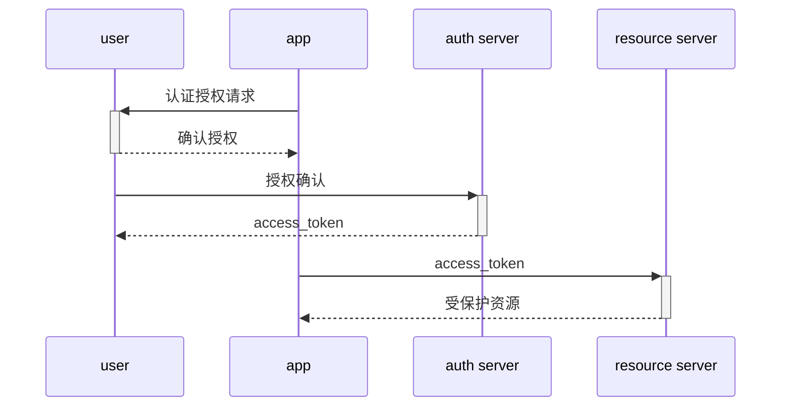

# OPEN

资源拥有者(user)
资源服务器(resource server)
应用客户端(app)
授权服务器(auth server)

User(用户):

user_id
user_account
user_auth_string

App(应用):

app_id
app_secret
app_account
app_auth_string
app_uris
app_grants

auth:

auth_code
expired_at
redirect_uri
app_id
user_id

token:

access_token
expired_at
app_id
user_id

